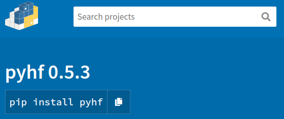
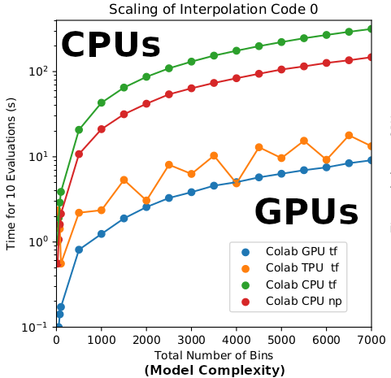
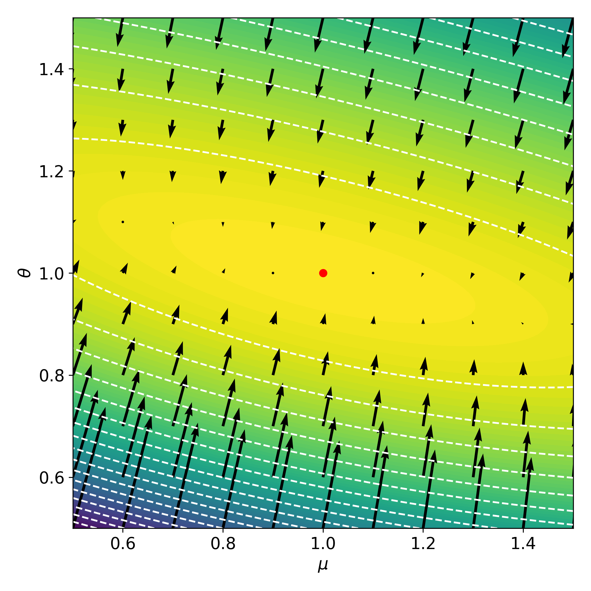
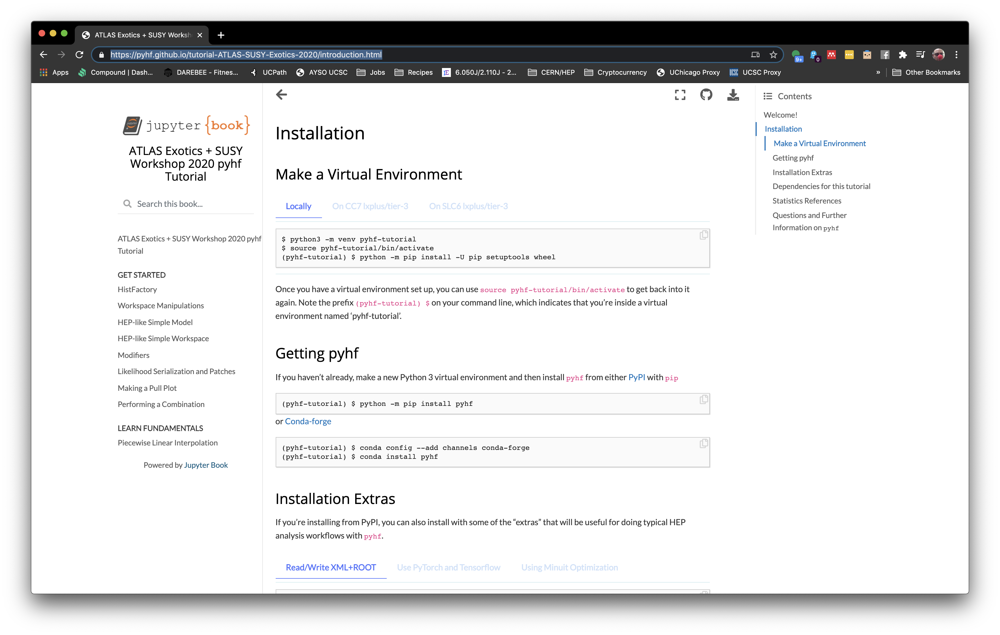

class: middle, center, title-slide
count: false

# `pyhf`: pure-Python implementation of HistFactory with tensors and automatic differentiation

<br>

.huge[Lukas Heinrich], .huge[Matthew Feickert], .huge.blue[Giordon Stark]<br><br>
.huge[(SCIPP, UC Santa Cruz)]
<br><br>
[gstark@cern.ch](mailto:gstark@cern.ch)

[ATLAS Statistics Forum](https://indico.cern.ch/event/979145/#6-pyhf-10-5)

December 10th, 2020

---
# `pyhf` team

<br><br>

.grid[
.kol-1-3.center[
.circle.width-80[]

[Lukas Heinrich](https://github.com/lukasheinrich)

CERN
]
.kol-1-3.center[
.circle.width-80[]

[Matthew Feickert](https://www.matthewfeickert.com/)

Illinois
]
.kol-1-3.center[
.circle.width-75[]

[Giordon Stark](https://github.com/kratsg)

UCSC SCIPP
]
]

---
# Questions

> We intend to organise two Statistics Forum meetings, where we invite the developers of various packages to give 10 min talks (followed by some time for discussion) focusing strictly on the following points:

- Please, provide a list of the functionalities of your toolkit.
- Out of all the toolkits, why do you think your users choose to use yours?
- What is the person-power contributing to the development and support of your toolkit? Which kind of documentation is provided and in which form (README, website, TWiki, others...)? Are things like JIRA and/or git used for issues and tasks?
- Is your toolkit using some external packages / common scripts / macros / functions to perform some of the operations like fit, limit setting, significance computation, Asimov-creation, ranking plot?
- Which pieces of your toolkit could be factorized out into a package that would be developed/supported/distributed by ATLAS?
- What additional common software could your toolkit take advantage of?
- Would you be willing to contribute to the development of a centrally distributed toolkit that provides functionality for providing common statistical operations (e.g. calculating a p-value)?

Speakers should .bold[upload their slides 48h in advance] of the meeting

---
# `pyhf`: HistFactory in pure Python

.kol-2-3[
<br>
- First non-ROOT implementation of the HistFactory p.d.f. template
   - .width-50[[](https://doi.org/10.5281/zenodo.1169739)]
- pure-Python library with Python and CLI API
  - [`$ pip install pyhf`](https://scikit-hep.org/pyhf/installation.html#install-from-pypi)
  - No dependence on ROOT!
- Open source tool for all of HEP
   - [IRIS-HEP](https://iris-hep.org/projects/pyhf.html) supported [Scikit-HEP project](https://scikit-hep.org/)
   - Used for reinterpretation in phenomenology paper <br>(DOI: [10.1007/JHEP04(2019)144](https://inspirehep.net/record/1698425)) and [`SModelS`](https://smodels.github.io/) ([arXiv:2009.01809](https://arxiv.org/abs/2009.01809))
   - Already in use by ATLAS SUSY groups, HH combination group, and for internal <br>pMSSM SUSY large scale reinterpretation
]
.kol-1-3.center[
.width-100[[](https://scikit-hep.org/pyhf/)]
.width-100[[](https://pypi.org/project/pyhf/)]
]

---
# Dependencies

.kol-1-2[
## Required dependencies

[Core libraries](https://github.com/scikit-hep/pyhf/blob/0370dbd5d728b2be90bab95c020ca85b384657b8/setup.cfg#L40-L46) (though all lightweight installs):

- [SciPy](https://www.scipy.org/) - Scientific Python (optimization routines)
- [click](https://click.palletsprojects.com/) - Command line interface
- [tqdm](https://tqdm.github.io/) - Progress bars
- [jsonschema](https://python-jsonschema.readthedocs.io/en/stable/) - HistFactory JSON specification
- [jsonpatch](https://python-json-patch.readthedocs.io/en/latest/) - Signal reinterpretation
- [PyYAML](https://github.com/yaml/pyyaml) - Command line niceties
]
.kol-1-2[
## Optional dependencies

Depending on what users want to do:

- [TensorFlow](https://www.tensorflow.org/) - autodiff, GPUs
- [PyTorch](https://pytorch.org/) - autodiff, GPUs
- [JAX](https://jax.readthedocs.io/en/latest/) - autodiff, GPUs, jit
- [iminuit](https://scikit-hep.org/iminuit) - alternative minimizer choice
- [uproot](https://uproot.readthedocs.io/) - ROOT I/O interop
]

.kol-1-1[
Getting "extras" is easy:

```
$ python -m pip install --upgrade pyhf[xmlio] # Gets uproot
$ python -m pip install --upgrade pyhf[backends] # Gets all backends
$ python -m pip install --upgrade pyhf[jax,xmlio,minuit] # Gets JAX, uproot, and iminuit
```
]

---
# Open Source Industry Tools for Computation

.grid[
.kol-2-3[
- All numerical operations implemented in .bold[tensor backends] through an API of $n$-dimensional array operations
- Using deep learning frameworks as computational backends allows for .bold[exploitation of autodiff and GPU acceleration]
- As huge buy in from industry we benefit for free as these frameworks are .bold[continually improved] by professional software engineers (physicists are not)

.kol-1-2.center[
.width-90[]
]
.kol-1-2[
<br>
- Show hardware acceleration giving .bold[order of magnitude speedup] for some models!
- Improvements over traditional
   - 10 hrs to 30 min; 20 min to 10 sec
]
]
.kol-1-4.center[
.width-85[]
.width-85[]
.width-85[]

<br>
.width-50[]
]
]

---
# Current Features

- [Unconstrained](https://scikit-hep.org/pyhf/_generated/pyhf.infer.mle.fit.html) and [constrained fits](https://scikit-hep.org/pyhf/_generated/pyhf.infer.mle.fixed_poi_fit.html)
- [Exclusion fits](https://scikit-hep.org/pyhf/examples/notebooks/hello-world.html)
- [Discovery fits](https://github.com/scikit-hep/pyhf/pull/520) (upcoming `v0.6.0` release)
- [Conversion to/from XML+ROOT to JSON](https://scikit-hep.org/pyhf/babel.html) (HistFitter and TRExFitter supported!)
- [Brazil bands](https://scikit-hep.org/pyhf/examples/notebooks/binderexample/StatisticalAnalysis.html)
- [Pull plots](https://github.com/scikit-hep/pyhf/blob/master/docs/examples/notebooks/pullplot.ipynb)<sup>†</sup>
- [Impact/ranking plots](https://github.com/scikit-hep/pyhf/blob/master/docs/examples/notebooks/ImpactPlot.ipynb)<sup>†</sup>
- [pseudoexperiments ("toys")](https://scikit-hep.org/pyhf/examples/notebooks/toys.html) (upcoming `v0.6.0` release)

.smaller[<sup>†</sup>Note: the `pyhf` API is meant to allow for higher-level frameworks to build on top, such as [`cabinetry`](https://github.com/alexander-held/cabinetry/).
- Missing a meta-language (DSL, metadata) that describes the data that can be passed to plotting utilities
- [`cabinetry`](https://github.com/alexander-held/cabinetry/) is meant to help with plotting things "correctly"
- All of this work is openly developed with extensive feedback
]

See our [<i class="fas fa-road"></i> roadmap](https://scikit-hep.org/pyhf/governance/ROADMAP.html) to get an idea of where we're going!

---
# Automatic Differentiation of `pyhf` Models

With tensor library backends gain access to _exact (higher order) derivatives_ &mdash; accuracy is only limited by floating point precision

$$
\frac{\partial L}{\partial \mu}, \frac{\partial L}{\partial \theta_{i}}
$$

.grid[
.kol-1-2[
.large[Exploit .bold[full gradient of the likelihood] with .bold[modern optimizers] to help speedup fit!]

<br><br>
.large[Gain this through the frameworks creating _computational directed acyclic graphs_ and then applying the chain rule (to the operations)]
]
.kol-1-2[
.center.width-80[]
]
]

---
# HEP Example: Likelihood Gradients

.footnote[Example adapted from [Lukas Heinrich's PyHEP 2020 tutorial](https://indico.cern.ch/event/882824/timetable/#45-introduction-to-automatic-d)]

.kol-1-2.center[
.width-90[]
]
.kol-1-2.center[
.width-90[]
]

.bold.center[Having access to the gradients makes the fit orders of magnitude faster than finite difference]

---
# Documentation and Development

.grid[
.kol-1-1.center[All documentation can be found at [https://scikit-hep.org/pyhf/](https://scikit-hep.org/pyhf/).]
.kol-1-2[
In this documentation you can find a list of:

- [Presentations](https://scikit-hep.org/pyhf/outreach.html#presentations)
- [Tutorials](https://scikit-hep.org/pyhf/outreach.html#tutorials)
- [Posters](https://scikit-hep.org/pyhf/outreach.html#posters)
- [Media outreach](https://scikit-hep.org/pyhf/outreach.html#in-the-media)

All of our documentation is tested nightly, against our software, as well as updates to software and tools we depend on. In addition to this, we've made full use of:

- [Sphinx](https://www.sphinx-doc.org/en/master/) - main documentation
- [Jupyter](https://jupyter.org/) - fundamentals and tutorials

]
.kol-1-2[
Most recently gave a successful, in-depth tutorial at the ATLAS SUSY+Exotics workshop.

.width-100[[](https://pyhf.github.io/tutorial-ATLAS-SUSY-Exotics-2020/introduction.html)]
]
]

---
# Why do users choose us?

.grid[
.kol-2-3.push-1-6.center.gray[<i class="fas fa-quote-left"></i> Out of all the toolkits, why do you think your users choose to use yours? <i class="fas fa-quote-right"></i>]
.kol-1-1[
- Easy to use and install: [PyPI](https://pypi.org/project/pyhf/), [TestPyPI](https://test.pypi.org/project/pyhf/), [conda-forge](https://anaconda.org/conda-forge/pyhf), and [Docker](https://hub.docker.com/r/pyhf/pyhf)
- Fast code, fast development cycle, fast feedback
- Well-documented Python implementations, clear communication channels to devs and community
- Command line complements the Pythonic API
  - We really love our CLI, it plays nicely with shell "behavior" such as piping
    ```
    $ pyhf prune --sample ttbar BkgOnly.json | pyhf inspect
    ```
- Significant test-driven development (underlies all of our work) with 1000+ tests!
  ```
  $ pytest --collect-only | grep "<Function\|<Class" -c
  1306
  ```
- Every commit tested in CI across Python 3.6, 3.7, 3.8 on Linux and MacOS systems with nightlies [](https://github.com/scikit-hep/pyhf/actions?query=workflow%3ACI%2FCD)

But we believe the biggest reason users choose `pyhf` is because
.center.huge[`pyhf` is developed openly and freely]
]
]
---
# Common scripts/macros/functions?

.grid[
.kol-2-3.push-1-6.center.gray[<i class="fas fa-quote-left"></i> Is your toolkit using some external packages / common scripts / macros / functions to perform some of the operations like fit, limit setting, significance computation, Asimov-creation, ranking plot? <i class="fas fa-quote-right"></i>]
.kol-1-1[
<br>
- Fits, limit setting: SciPy and minuit
- Test statistics are implemented in `pyhf`
- Asimov creation: just a fit in `pyhf` to generate the Asimov dataset
]
]

---
# Common software for ATLAS?

.grid[
.kol-2-3.push-1-6.center.gray[<i class="fas fa-quote-left"></i> Which pieces of your toolkit could be factorized out into a package that would be developed/supported/distributed by ATLAS? <i class="fas fa-quote-right"></i>]
.kol-1-1[
<br>
We don't necessarily believe any particular piece needs to be factorized out into a package maintained by ATLAS.
- pure-Python implementation of HistFactory (a mathematical model)
- `pyhf` is a low(er)-level library to interact with the HistFactory JSON workspaces
- Higher-level tools are encouraged to build on top of `pyhf` to extend the functionality into plots, limit setting, and other debugging utilities
   - c.f. [`cabinetry`](https://github.com/alexander-held/cabinetry) as excellent example
]
]

---
# Additional common software?

.grid[
.kol-2-3.push-1-6.center.gray[<i class="fas fa-quote-left"></i> What additional common software could your toolkit take advantage of? <i class="fas fa-quote-right"></i>]
.kol-1-1[
<br>
- Not sure
- We are willing to try out new ideas all the time
- If you have ideas, get in [touch with us!](https://github.com/scikit-hep/pyhf/issues/new?template=feature-request.md)
]
]

---
# Contributing to central toolkit?

.grid[
.kol-2-3.push-1-6.center.gray[<i class="fas fa-quote-left"></i> Would you be willing to contribute to the development of a centrally distributed toolkit that provides functionality for providing common statistical operations (e.g. calculating a $p$-value)? <i class="fas fa-quote-right"></i>]
.kol-1-1[
<br>
- Cannot make any promises at this time
- All core developers are very busy with convener roles and contact roles in ATLAS and IRIS-HEP
]
]

---
# Summary
.kol-2-3[
.large[`pyhf` provides:]
- .large[.bold[Accelerated] fitting library]
   - reducing time to insight/inference!
   - Hardware acceleration on GPUs and vectorized operations
   - Backend agnostic Python API and CLI
- .large[Flexible .bold[declarative] schema]
   - JSON: ubiquitous, universal support, versionable
- .large[Enabling technology for .bold[reinterpretation]]
   - JSON Patch files for efficient computation of new signal models
   - Unifying tool for theoretical and experimental physicists
- .large[Project in growing .bold[Pythonic HEP ecosystem]]
   - [Openly developed on GitHub](https://github.com/scikit-hep/pyhf) and welcome contributions
   - [Comprehensive open tutorials](https://pyhf.github.io/tutorial-ATLAS-SUSY-Exotics-2020/introduction.html)
   - Ask us about Scikit-HEP and IRIS-HEP!
]
.kol-1-3[
<br>
<br>
<br>
.center.width-100[[](https://github.com/scikit-hep/pyhf)]
]

---
class: middle

.center[
# Thanks for listening!
# Come talk with us!

.large[[www.scikit-hep.org/pyhf](https://scikit-hep.org/pyhf/)]
]
.grid[
.kol-1-3.center[
.width-90[[](https://scikit-hep.org/)]
]
.kol-1-3.center[
<br>
.width-90[[](https://github.com/scikit-hep/pyhf)]
]
.kol-1-3.center[
<br>
<br>
.width-100[[](https://iris-hep.org/)]
]
]

---
class: end-slide, center

.large[Backup]

---
# External dependencies

Required dependencies from our `setup.cfg`:

.grid[
.kol-2-3[
```
install_requires =
    scipy>=1.4.0
    click>=6.0
    tqdm
    jsonschema>=3.2.0
    jsonpatch
    pyyaml
```

- [SciPy](https://www.scipy.org/) - Scientific Python (optimization routines)
- [click](https://click.palletsprojects.com/) - Command line interface
- [tqdm](https://tqdm.github.io/) - Progress bars
- [jsonschema](https://python-jsonschema.readthedocs.io/en/stable/) - HistFactory JSON specification
- [jsonpatch](https://python-json-patch.readthedocs.io/en/latest/) - Signal reinterpretation
- [pyyaml](https://github.com/yaml/pyyaml) - Command line niceties
]
.kol-1-3.center[
.width-50[]
<br /><br /><br />
.width-50[]
<br /><br />
.width-25[]
]
]

---
# Optional dependencies

We have lots of optional dependencies depending on what users want to do:

- [TensorFlow](https://www.tensorflow.org/) - autodiff
- [PyTorch](https://pytorch.org/) - autodiff
- [JAX](https://jax.readthedocs.io/en/latest/) - autodiff, jit
- [iminuit](https://scikit-hep.org/iminuit) - alternative minimizer choice
- [uproot](https://uproot.readthedocs.io/) - ROOT I/O interop

---
# HistFactory Model

- A flexible probability density function (p.d.f.) template to build statistical models in high energy physics
- Developed in 2011 during work that lead to the Higgs discovery [[CERN-OPEN-2012-016](http://inspirehep.net/record/1236448)]
- Widely used by the HEP community for .bold[measurements of known physics] (Standard Model) and<br> .bold[searches for new physics] (beyond the Standard Model)

.kol-2-5.center[
.width-90[[](https://atlas.web.cern.ch/Atlas/GROUPS/PHYSICS/PAPERS/HIGG-2016-25/)]
.bold[Standard Model]
]
.kol-3-5.center[
.width-100[[](https://atlas.web.cern.ch/Atlas/GROUPS/PHYSICS/PAPERS/SUSY-2016-16/)]
.bold[Beyond the Standard Model]
]

---
# HistFactory Template

$$
f\left(\mathrm{data}\middle|\mathrm{parameters}\right) =  f\left(\vec{n}, \vec{a}\middle|\vec{\eta}, \vec{\chi}\right) = \color{blue}{\prod\_{c \\,\in\\, \textrm{channels}} \prod\_{b \\,\in\\, \textrm{bins}\_c} \textrm{Pois} \left(n\_{cb} \middle| \nu\_{cb}\left(\vec{\eta}, \vec{\chi}\right)\right)} \\,\color{red}{\prod\_{\chi \\,\in\\, \vec{\chi}} c\_{\chi} \left(a\_{\chi}\middle|\chi\right)}
$$

.bold[Use:] Multiple disjoint _channels_ (or regions) of binned distributions with multiple _samples_ contributing to each with additional (possibly shared) systematics between sample estimates

.kol-1-2[
.bold[Main pieces:]
- .blue[Main Poisson p.d.f. for simultaneous measurement of multiple channels]
- .katex[Event rates] $\nu\_{cb}$ (nominal rate $\nu\_{scb}^{0}$ with rate modifiers)
- .red[Constraint p.d.f. (+ data) for "auxiliary measurements"]
   - encode systematic uncertainties (e.g. normalization, shape)
- $\vec{n}$: events, $\vec{a}$: auxiliary data, $\vec{\eta}$: unconstrained pars, $\vec{\chi}$: constrained pars
]
.kol-1-2[
.center.width-100[[](https://atlas.web.cern.ch/Atlas/GROUPS/PHYSICS/PAPERS/SUSY-2016-16/)]
.center[Example: .bold[Each bin] is separate (1-bin) _channel_,<br> each .bold[histogram] (color) is a _sample_ and share<br> a .bold[normalization systematic] uncertainty]
]

---
# HistFactory Template

$$
f\left(\vec{n}, \vec{a}\middle|\vec{\eta}, \vec{\chi}\right) = \color{blue}{\prod\_{c \\,\in\\, \textrm{channels}} \prod\_{b \\,\in\\, \textrm{bins}\_c} \textrm{Pois} \left(n\_{cb} \middle| \nu\_{cb}\left(\vec{\eta}, \vec{\chi}\right)\right)} \\,\color{red}{\prod\_{\chi \\,\in\\, \vec{\chi}} c\_{\chi} \left(a\_{\chi}\middle|\chi\right)}
$$

<br>
Mathematical grammar for a simultaneous fit with

- .blue[multiple "channels"] (analysis regions, (stacks of) histograms)
- each region can have .blue[multiple bins]
- coupled to a set of .red[constraint terms]

<br>
.center[.bold[This is a _mathematical_ representation!] Nowhere is any software spec defined]
.center[.bold[Until recently] (2018), the only implementation of HistFactory has been in [`ROOT`](https://root.cern.ch/)]

---
# HistFactory Template (in more detail)

$$
f\left(\vec{n}, \vec{a}\middle|\vec{\eta}, \vec{\chi}\right) = \color{blue}{\prod\_{c \\,\in\\, \textrm{channels}} \prod\_{b \\,\in\\, \textrm{bins}\_c} \textrm{Pois} \left(n\_{cb} \middle| \nu\_{cb}\left(\vec{\eta}, \vec{\chi}\right)\right)} \\,\color{red}{\prod\_{\chi \\,\in\\, \vec{\chi}} c\_{\chi} \left(a\_{\chi}\middle|\chi\right)}
$$

$$
\nu\_{cb}(\vec{\eta}, \vec{\chi}) = \sum\_{s \\,\in\\, \textrm{samples}} \underbrace{\left(\sum\_{\kappa \\,\in\\, \vec{\kappa}} \kappa\_{scb}(\vec{\eta}, \vec{\chi})\right)}\_{\textrm{multiplicative}} \Bigg(\nu\_{scb}^{0}(\vec{\eta}, \vec{\chi}) + \underbrace{\sum\_{\Delta \\,\in\\, \vec{\Delta}} \Delta\_{scb}(\vec{\eta}, \vec{\chi})}\_{\textrm{additive}}\Bigg)
$$

.bold[Use:] Multiple disjoint _channels_ (or regions) of binned distributions with multiple _samples_ contributing to each with additional (possibly shared) systematics between sample estimates

.bold[Main pieces:]
- .blue[Main Poisson p.d.f. for simultaneous measurement of multiple channels]
- .katex[Event rates] $\nu\_{cb}$ from nominal rate $\nu\_{scb}^{0}$ and rate modifiers $\kappa$ and $\Delta$
- .red[Constraint p.d.f. (+ data) for "auxiliary measurements"]
   - encoding systematic uncertainties (normalization, shape, etc)
- $\vec{n}$: events, $\vec{a}$: auxiliary data, $\vec{\eta}$: unconstrained pars, $\vec{\chi}$: constrained pars

---
# Why is the likelihood important?

.kol-1-2.width-90[
<br>
- High information-density summary of analysis
- Almost everything we do in the analysis ultimately affects the likelihood and is encapsulated in it
   - Trigger
   - Detector
   - Combined Performance / Physics Object Groups
   - Systematic Uncertainties
   - Event Selection
- Unique representation of the analysis to reuse and preserve
]
.kol-1-2.width-100[
<br><br>
[](https://indico.cern.ch/event/839382/contributions/3521168/)
]

---
# References

1. F. James, Y. Perrin, L. Lyons, .italic[[Workshop on confidence limits: Proceedings](http://inspirehep.net/record/534129)], 2000.
2. ROOT collaboration, K. Cranmer, G. Lewis, L. Moneta, A. Shibata and W. Verkerke, .italic[[HistFactory: A tool for creating statistical models for use with RooFit and RooStats](http://inspirehep.net/record/1236448)], 2012.
3. L. Heinrich, H. Schulz, J. Turner and Y. Zhou, .italic[[Constraining $A_{4}$ Leptonic Flavour Model Parameters at Colliders and Beyond](https://inspirehep.net/record/1698425)], 2018.
4. A. Read, .italic[[Modified frequentist analysis of search results (the $\\mathrm{CL}_{s}$ method)](http://cds.cern.ch/record/451614)], 2000.
5. K. Cranmer, .italic[[CERN Latin-American School of High-Energy Physics: Statistics for Particle Physicists](https://indico.cern.ch/event/208901/contributions/1501047/)], 2013.
6. ATLAS collaboration, .italic[[Search for bottom-squark pair production with the ATLAS detector in final states containing Higgs bosons, b-jets and missing transverse momentum](http://inspirehep.net/record/1748602)], 2019
7. ATLAS collaboration, .italic[[Reproducing searches for new physics with the ATLAS experiment through publication of full statistical likelihoods](https://cds.cern.ch/record/2684863)], 2019
8. ATLAS collaboration, .italic[[Search for bottom-squark pair production with the ATLAS detector in final states containing Higgs bosons, b-jets and missing transverse momentum: HEPData entry](https://www.hepdata.net/record/ins1748602)], 2019

---

class: end-slide, center
count: false

The end.
